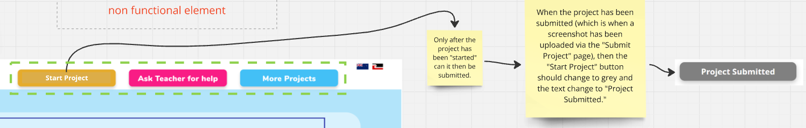

# The Mission X Brief

is enormous, but we need to pick our sections to help us organise and create a scaffold around.

Before anything else, please open up the directory:

OK so here's some things to remember:

## A. General stuff

### Don't worry too much about the CSS.

... because the CSS we'll need is already outlined in the Adobe XD document:

https://xd.adobe.com/view/6f52b708-fde0-4967-bdea-98a46169b9b1-3a01/specs/

To have a look for yourself:

1. click any element on any slide (even the text bits)
2. hit the </> button on the right edge sidebar
3. behold the pre-done CSS and other bits and bobs on the right side.

### Pick a colour, then focus only on the stuff in that colour.

Don't get caught up in the size of the project or the pieces that you can't 'see'. Either it's _nobody's section_ (which are uncoloured bits in the miro board), or it's _somebody else's section_.

### Once you have a good idea which section you want to work on, read the rest of the brief.

Picking our sections is important for organising, and that's all this shortened brief tries to do. This isn't a replacement for the brief. At most, it should let you know which sections on the brief to kinda jump over because you can go, 'oh, that's not my job since I picked the other thing'.

## B. Key take-aways for each colour

Here's hopefully a quick skim if you want to see what you might be interested in. The colours are not in the design brief, but they're used to represent each section and bridge the brief to the miro board visuals.

### 1. Yellow - Home & Log-in/Sign-up

(Brief page 5, near the bottom)

1. _Home_ is our ground floor webpage. There's some buttons that cycle through what's displayed near the bottom of the page&mdash;

> &mdash;and some RWD work to be done:

> These icons need to go from horizontal on desk devices to vertical on mobile.

2. _Log-in/Sign-up_ is neat. So yeah, ctlr+click this link:

https://xd.adobe.com/view/6f52b708-fde0-4967-bdea-98a46169b9b1-3a01/?fullscreen

> and click the magenta (pink? rose? idk) 'Sign Up' button. Throws up a container that renders over the main page, blurs everything else, and changes content depending on if you click 'LOG IN' or 'SIGN UP', either in the student or teacher section. Very spiffy, you will feel so much satisfaction coding that.

### 2. Green - Project Library & Student Profile Viewer

(Brief page 10)

1. _Project Library_ has two major parts. Apparently, the content filters 'can be created using SQL queries in the backend'. Those filters have three tiers: difficulty; 'free' & 'subscription' content; and this thing:

> At first blush it'll be a lot of lining classes up. There's an 'Introduction' slide that's just a big link to _Student Dashboard_ (more on that later, or skip to it using the directory). The project slides themselves present as chunky flex-box. Fun part is, you get to decide which projects are free, sub-only, their difficulty levels, all those other filter categories. The brief doesn't specify which is which, and we need at least 3 to display & filter correctly.

> Finally, _Project Library_ looks slightly different if user = student vs if user = teacher, but that part's not a big deal. That and everything else is just buttons and anchor tags.

2. _Student Profile Viewer_ a mostly static webpage. Wait for whoever's working on Yellow/Home page to finish their header and footer, because you can just copy that part of their homework. The viewer will need to draw information on the student from a database. Otherwise, just a bunch of buttons.

### 3. Pink - The Project Builder aka 'Learning Objectives', 'Instructions', 'Video Tutorial', and'Make Project'

(Brief page 11, but the "Submit Project" section on page 12 is not part of this category. See Orange section below)

> 'The Project Builder page is the main workbench for students.' It looks chunky, but sink your teeth in and it's not too substantial. Kinda like pavlova, you know? Mmmm, pavlova. Also, the "Submit Project" page and a little progress tracker that displays on these pages are somebody else's jobs, so say hi to to them once your work's done.

1. _Learning Objectives_ has this neat sidebar that is also collapsible using these tabs:

It also has these buttons, one of which has conditional statement requirements:

2. _Instructions, Video Tutorial, & Make Project_ have large portions of their pages just grabbing pre-existing content (HTML, pics, video) from a database and rendering it onto the screen. Easy (like eating a pavlova). Looks like once you've got the UI sorted and your code is capable of pulling correctly from a database, you're golden. Beyond that, it's a bunch of buttons.

### 4. Orange - Submit Project & Project Submissions

(Brief page 12 & not explicity detailed on brief, respectively)

1. _Submit Project_ can be treated as a container nested within the wider Pink section detailed above, so once you're done with this part be sure to say hi to whoever's working on Pink so they can pop your container in there.

> Main focus is a big button that, when clicked, calls a function that grabs a screenshot, attaches a bunch of information to it about when it was taken, then saves it as a URL in the backend. Looks like you'll need to study this as an example component of how that can work (ctrl+click): https://github.com/Mission-Ready/MissionX-Screenshot-Upload. Look, I've been mostly neutral, but this part looks complicated. Someone can correct me if I'm wrong, but this is what the experts call a 'big learning opportunity'.

2. _Project Submissions_ is the other side. Grabs those URLs from the database then presents them to the teacher as a list on the page with thumbnails which the teacher can enlarge into the full photo. Each submission gets a checkbox to allow the teacher to affect more than one submission with the pièce de résistance, a '✔️MARK AS COMPLETED PROJECT' button. There is no 'DELETE ALL'. That would be mean.

### 5. Blue - Student Profile List & Progress Tracker

(not explicity detailed on brief)

1. _Student Profile List_ is a wide pane that contains a bunch of large buttons which renders pre-existing data from a database: each student's picture and their name. This looks more about accessing that back-end and giving it a nice clean way to a page than anything else.

2. I have a sneaking suspicion the _Progress Tracker_ has the bulk of what you need to know to code it hidden behind Mission Four. Either that, or literally is Mission Four. It grabs student & project completion info from a database, links each student to how many completed projects they've done, presents that info as a lovely row of buttons that are coloured in for every finished project, and allows the teacher to export all of the above into a handy-dandy spreadsheet. So yeah, very backend-work-ey.

### 6. Cyan - Help Requests & Teacher Profile Viewer

(not explicity detailed on brief)

1. _Help Requests_ is heavy on the backend work. Students working on projects can hit a button that basically sends an 'I asked for help' token to a database with their student ID number and the date and time they sent that request. _Help Requests_ grabs those tokens, lists them up for the teacher in order of newest to oldest, splashes on the student's photo and name, and adds a checkbox to each list item for the teacher to tick before hitting the '✔️MARK AS DONE' button, which also updates those tokens so the teacher knows they're done. Amazing.

2. _Teacher Profile Viewer_ is pretty self-explanatory, and is similar to a version the students can view for their own profiles. However, teachers get an extra button that lets them go straight from their profile viewer to the _Help Requests_ dashboard.
